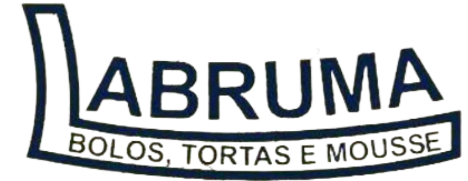

<<<<<<< HEAD

    <h1 style=" display:flex;
            justify-content:center;
           background-image: url('./my-project/src/assets/fundoo.jpg');">
    
    </h1>
    <h1 style="">
        Landing Page da Labruma Bolos 🍰
    </h1>

    <h1>📕 Sobre</h1>
    

        Decidi criar este site para mostrar meu trabalho, habilidades e paixão pela programação. Minha inspiração veio de uma confeitaria chamado Labruma Bolos. Espero que este site seja uma porta de entrada para novas oportunidades e conexões na área de desenvolvimento web.
    

    <h2>⛏️Ferramentas</h2>
     <ul>
        <li>
            Javascript
        </li>
        <li>
        React.Js
        </li>
        <li>
        Tailwind.css
        </li>
        <li>
        Sonner
        </li>
        <li>
        Swiper
        </li>
     </ul>

# 🖥️ Layout Mobile  e Desktop
 
 
Visualize o layout mobile e para desktop no link abaixo, espero que gostem da interface desenvolvida.

 Link: https://youtube.com/shorts/dYQCJn_rbEo?si=2Kc-Db4WFKXWI90G
